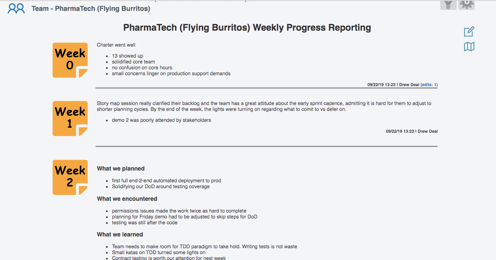

## Main Screens
### List of current teams in engagements

Current Teams is the default tab to team engagements, bringing the user directly into mind of whats happening NOW with current coaches, facilities and team health.
From here, accessing weekly reports, current notes, VSMs and Edit links are clear, and don't require page loads. Filtering by location is a global selection from the top-right icons.

### Team engagement schedule

Weeks are highlighted and defaulted to a blocked inference as 6 week engagements are a common standard. Charters and Consults are also supported by default. Configure new types as fits your need.

### Value Stream Mapping

This tool allows coaches a clear and simple way to make the value stream visible both locally and remotely for teams. With standard value sets that don't add complexity or require follow up for publishing, teams are empowered to own their process improvements and publish in real time.

### Weekly Reporting for teams

This is simply the first use case we have needed for a team detail page. If your organization benefits from a weekly report from coaches on team benefits for Dojos or other engagement types, this can be both an internal publisher as well as source for consolidated reporting.

## Pop ups and edit screens
### pop up for coaching notes on current teams (or lead tracking notes)

From the list views, clicking on the notes column (blue) will pop-up a history of notes taken from event stream

### Intake pipeline of potential engagements

Notes for intake as well as coaching notes is one of many editing panes for each team

### Markdown is not only supported, but previewed

As much as we wish everyone was comfortable with markdown, most of us still like the option of a legend and real-time previews. this pop up option in the editor removes all barriers for styling for all users.

