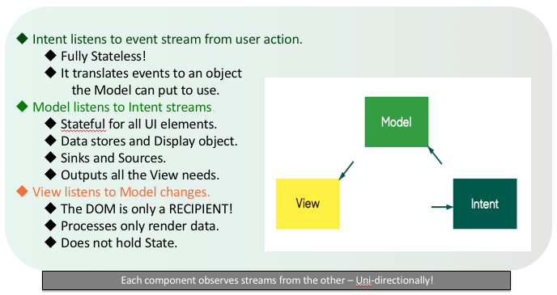

# Technologies

* [NodeJS](https://nodejs.org/en/) (v6.11.4)
* [CycleJS](https://cycle.js.org/) ([v7.0.0](https://github.com/cyclejs/cyclejs/releases/tag/v7.0.0))
* [EventStore](https://eventstore.org/) (v4.0.2)
* [Docker](https://www.docker.com/) (v17.05.0-ce)

# Contributing to teamTrek

## Quick Pre-reqs

- Install git
- Install NodeJS
- Clone this repo
- `$ npm install`

## Use Chrome for development, use and testing.
teamTrek is currently only tested to work on Chrome, although Edge and newer FireFox appears to be fine.


# Running and Debugging teamTrek

To serve teamTrek locally (http://localhost:8080) on your development machine, after `npm install`, just execute:

```
$ npm start
```

Now, any time you update a JavaScript file in the *src* directory on your machine a new build will be created updating the *dist* directory and refreshing your browser reflecting the update.

The terminal window will show you the rebuild, or a parsing error. On success, refresh browser to see changes:

```
4750135 bytes written to dist/app.js (0.75 seconds) at 10:40:32 AM
File change detected /Users/$user/repos/teamTrek/dist/app.js
```

# Accessing EventStore Data

Install EventStore and run

### Local EventStore Install
You will need to edit local data in testing -- install EventStore locally. Instructions to follow, but in essence, you will be hitting your local DB via http://localhost:2113/ simply by changing the URL in browser to http://localhost:8080/debug.html

### Dev session management
You will need to have a session for a dev environment to navigate properly. To do this, first visit your team shared Dev URL and copy your ttID cookie, then paste it in here in the src/model.js file:
```
    // Cookie.set("ttID", "PASTE_COOKIE_HERE", { expires: 7 }) // for dev ENV ONLY. Do not commit it setting!
```
This should cause a refresh and your session will come alive. MAKE SURE to comment the model.js line out again and do not leave your cookie value in the code -- EVER.

In some cases, you may need to bypass CORS to get to data. More on that [here](./readmeAssets/readme.md) 

# About [CycleJS](https://cycle.js.org)

## Key Essentials of this FRP Front-end framework 

### Strict separation of concerns with Model-View-Intent (MVI)
* **Model**: Manages ALL state and business logic using mutable objects.
* **View**: Stateless. Simply implements view logic on received state from model.
* **Intent**: Stateless. Simply observes user events and streams a model-friendly object to model observers.



### Functional

* Composed, functional programming coding style.
* Reusable functions highly favored.

### Reactive

* [RxJS](http://reactivex.io/rxjs/) means we are coding reactively, not imperatively! RxJS is a library for reactive programming using *Observables*, to make it easier to compose asynchronous or callback-based code.

### Hyperscript

* Leverages hyperscript instead of JSX or HTML. For example: 
`h('div.someClass', "content")` 
 instead of 
`<div class="someClass">content</div>`

